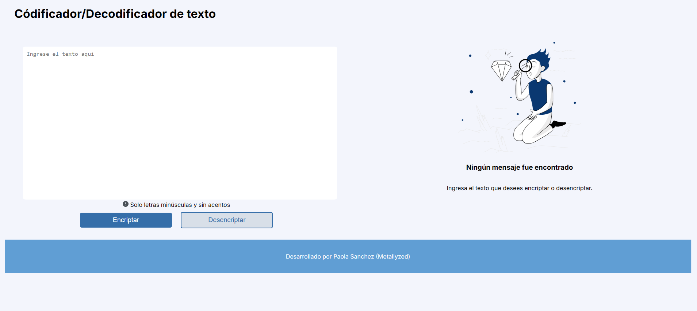

# challenge-encriptador

## Descripción del proyecto
Este proyecto es un challenger asociado al curso alura de Oracle One.

## Aplicación
Esta aplicación consiste de un condificador/decodificador en base a unas reglas previamente establecidas.

## Autor
- Paola Sanchez